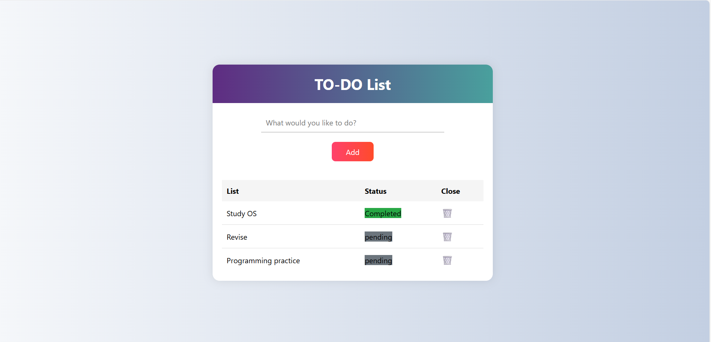

# TODO List App 📝

A simple and stylish to-do list built with HTML, CSS, and JavaScript.

## Features
- Add, delete, and mark tasks as completed
- Status badges: pending or completed
- Responsive and modern UI

## Preview

## How to Run
1. Clone the repo
2. Open `index.html` in your browser
